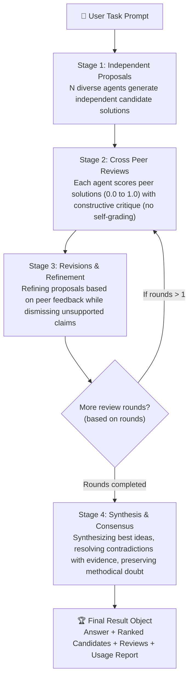

<p align="center">
  
</p>

<h1 align="center">Swarmmy 🐝</h1>

<p align="center">
  <strong>Bounded Peer-Review Swarm Orchestration for Instruction Models</strong><br>
  <em>A high-performance, zero-dependency framework for orchestrating intelligent agent swarms via structured peer review and strict mathematical budget bounds.</em>
</p>

<p align="center">
  <a href="https://pypi.org/project/swarmmy/"></a>
  <a href="https://www.python.org/downloads/"></a>
  <a href="LICENSE"></a>
  <a href="#"></a>
  <a href="#"></a>
  <a href="#"></a>
</p>

<p align="center">
  <a href="#-why-swarmmy">Why Swarmmy?</a> •
  <a href="#-swarm-architecture">Architecture</a> •
  <a href="#-installation">Installation</a> •
  <a href="#-supported-providers">Supported Providers</a> •
  <a href="#-tutorials">Tutorials</a> •
  <a href="examples/">Examples Catalog</a> •
  <a href="#-cli-tool">CLI Tool</a> •
  <a href="#-api-reference">API Reference</a> •
  <a href="README_AR.md">العربية</a>
</p>

---

## 🌟 Why Swarmmy?

In Large Language Models (LLMs), relying on a solitary call often leads to untested assumptions, logic gaps, and hallucinations. Meanwhile, traditional multi-agent frameworks often suffer from **infinite execution loops**, runaway token bills, and massive dependency bloat (>500 MB).

**Swarmmy** introduces an entirely different engineering philosophy: deterministic, bounded, and ultra-lightweight.

| Criterion | Single LLM Call | Traditional Agent Frameworks (CrewAI / AutoGen) | **Swarmmy 🐝** |
| :--- | :---: | :---: | :---: |
| **Perspective & Role Diversity** | ❌ Single viewpoint | ⚠️ Complex configuration, verbose prompts | ✅ **Distinct autonomous roles generated automatically** |
| **Critical Peer Review** | ❌ Self-confirmation bias | ⚠️ Agents often grade themselves | ✅ **Disciplined cross-review (no self-grading)** |
| **Cost & Call Ceiling** | 1 call | ❌ Unbounded (prone to infinite loops) | ✅ **Hard mathematical upper bound: `N*(2+2R)+1`** |
| **External Dependencies** | Dependent on SDKs | ❌ Heavy packages (>500MB) | ✅ **Zero external dependencies (Pure Python stdlib)** |
| **Rate Limiting & 429 Protection** | Manual | ⚠️ Inconsistent | ✅ **Built-in RPM Throttling + Adaptive 429 Retry** |
| **Real-Time Live Formatted Output** | Raw text | Cluttered / unstructured console text | ✅ **Live colorized terminal dashboard per agent & stage** |

---

## 🔬 Swarm Architecture

The swarm operates across 4 mathematically bounded, rigorous stages:



### 📐 Mathematical Upper Bound:
$$\text{Max Calls} = N \times (2 + 2R) + 1$$
- Where $N$ = Number of peer agents.
- And $R$ = Number of revision and review rounds.
- **Example**: 4 agents and 1 round = $4 \times (2 + 2) + 1 = 17$ maximum total calls (strictly enforced hard ceiling).

---

## 📦 Installation

Requires Python **3.10 or higher**:

```bash
# 1. Base installation (supports all cloud providers + Ollama with zero external dependencies)
pip install swarmmy

# 2. Optional: Local GPU inference for Hugging Face models (PyTorch)
pip install 'swarmmy[hf]'
```

---

## 🌐 Supported Providers

Swarmmy includes built-in native providers for major LLM services, communicating directly via Python's standard library with zero third-party dependencies required:

| Provider | Identifier in `create_provider` | Default Model | API Key Environment Variable |
| :--- | :--- | :--- | :--- |
| **Google Gemini** | `"gemini"` or `"google"` | `gemini-2.0-flash` | `GEMINI_API_KEY` or `GOOGLE_API_KEY` |
| **Anthropic Claude** | `"anthropic"` or `"claude"` | `claude-3-5-sonnet-20241022` | `ANTHROPIC_API_KEY` |
| **OpenAI** | `"openai"` | `gpt-4o-mini` | `OPENAI_API_KEY` |
| **Groq (Ultra-fast Llama/Mixtral)** | `"groq"` | `llama-3.3-70b-versatile` | `GROQ_API_KEY` |
| **DeepSeek (V3 & R1)** | `"deepseek"` | `deepseek-chat` | `DEEPSEEK_API_KEY` |
| **Ollama (Local & Offline)** | `"ollama"` | `llama3:latest` | Connects to `http://localhost:11434` |
| **Mistral AI** | `"mistral"` | `mistral-large-latest` | `MISTRAL_API_KEY` |
| **Cohere (Command R+)** | `"cohere"` | `command-r-plus-08-2024` | `COHERE_API_KEY` |
| **OpenRouter (200+ models)** | `"openrouter"` | `meta-llama/llama-3.3-70b-instruct` | `OPENROUTER_API_KEY` |
| **Azure OpenAI** | `"azure"` | Deployment-dependent | `AZURE_OPENAI_API_KEY` |
| **Hugging Face (Serverless API)** | `"hf-api"` | Custom | `HF_TOKEN` |
| **Hugging Face (Local GPU)** | `"hf"` | Local model path | No key required |

---

## 📚 Tutorials

> 💡 **Looking for provider-specific guides & code?** Explore our dedicated **[Examples Catalog](examples/)** organized by provider:
> [Google Gemini](examples/gemini/) • [OpenAI](examples/openai/) • [Anthropic Claude](examples/anthropic/) • [Groq](examples/groq/) • [DeepSeek](examples/deepseek/) • [Ollama Offline](examples/ollama/) • [Hugging Face Local GPU](examples/huggingface/) • [OpenRouter](examples/openrouter/) • [Mistral](examples/mistral/) • [Cohere](examples/cohere/) • [Azure OpenAI](examples/azure/) • [Custom Callables & Streaming](examples/custom_and_streaming/)

### Tutorial 1: Quickstart in 30 Seconds

#### A. Synchronous Usage (`run_sync`):
Ideal for straightforward scripts, CLI tools, and Jupyter Notebooks:

```python
from swarmmy import run_sync, create_provider, Config

# Create the provider (automatically reads API key from environment variables)
backend = create_provider("gemini")

# Run the swarm in a single synchronous call
result = run_sync(
    "Propose an architectural plan for an educational platform handling 1M concurrent users and review vulnerabilities.",
    backend=backend,
    config=Config(agents=4, rounds=1)
)

print("🏆 Final Synthesized Answer:")
print(result.answer)
print(f"\nTotal API Calls: {result.calls} | Elapsed Time: {result.elapsed_seconds:.2f}s")
```

#### B. Asynchronous Usage (`asyncio`):
Ideal for high-concurrency cloud services, web backends, and async pipelines (FastAPI / Starlette):

```python
import asyncio
from swarmmy import Swarm, Config, create_provider

async def main():
    backend = create_provider("anthropic", model="claude-3-5-sonnet-20241022")
    swarm = Swarm(backend=backend, config=Config(agents=4, rounds=1, concurrency=4))
    
    result = await swarm.run("Design an intelligent load-balancing algorithm and benchmark against alternatives.")
    
    # Inspect individual candidate solutions and their peer scores
    for candidate in result.candidates:
        print(f"Candidate {candidate.id} - Peer Score: {candidate.peer_score}")

    print("\nFinal Answer:\n", result.answer)

if __name__ == "__main__":
    asyncio.run(main())
```

---

### Tutorial 2: Offline Local Swarm via Ollama

Run an entire swarm completely offline on your local machine with zero data sent to external cloud servers:

```python
from swarmmy import run_sync, create_provider, Config

# Ensure Ollama is running: ollama run llama3 or ollama run deepseek-r1:8b
backend = create_provider("ollama", model="llama3:latest")

result = run_sync(
    "Explain the differences between Event-Driven Architecture and Monolith with practical examples.",
    backend=backend,
    config=Config(agents=3, rounds=1)
)

print(result.answer)
```

---

### Tutorial 3: Live Rich Colored Console

Observe the thought process, peer grading, and revisions of every agent in real time with distinct colors and formatted boxes:

```python
from swarmmy import run_sync, create_provider, Config

backend = create_provider("groq", model="llama-3.3-70b-versatile")

# Enable live streaming terminal output via live=True
result = run_sync(
    "Design a disaster-resilient multi-region cloud infrastructure.",
    backend=backend,
    config=Config(agents=3, rounds=1),
    live=True  # 👈 Enables real-time colored live display
)
```

**Terminal Output Preview:**
```text
========================================================================
  >>> STAGE 1: PROPOSALS <<<
      Independent solutions generated across diverse roles
========================================================================

┌─ AGENT 0 (PROPOSE | 0.35s) [OK] ────────────────────────────────────┐
│   Proposal 0: Active-active multi-region deployment with Aurora Global.
└──────────────────────────────────────────────────────────────────────┘

┌─ AGENT 1 (PROPOSE | 0.38s) [OK] ────────────────────────────────────┐
│   Proposal 1: Event-driven replication using Kafka MirrorMaker 2.
└──────────────────────────────────────────────────────────────────────┘

========================================================================
  >>> STAGE 2: PEER REVIEWS <<<
      Cross-evaluating peer solutions (no self-grading)
========================================================================

┌─ AGENT 0 (REVIEW | 0.25s) [OK] ─────────────────────────────────────┐
│   🎯 Review for Agent 1: Score: 0.90 (★★★★★)
│      "Strong consistency guarantees, but consider cross-region network costs."
└──────────────────────────────────────────────────────────────────────┘
```

---

### Tutorial 4: Usage Limits, Rate Limiting & Budgeting

Protect your account from exceeding API limits (e.g. 15 RPM on Gemini free tiers) and control spend with hard cost limits:

```python
from swarmmy import Config, UsageLimits, create_provider, run_sync

# Configure strict usage and budget boundaries
limits = UsageLimits(
    rpm=15,                   # Max 15 requests per minute (automatic client-side rate limiting)
    max_total_tokens=40_000,  # Hard ceiling on total consumed tokens (prompt + completion)
    max_cost_usd=0.05,        # Hard budget cap: $0.05 USD (stops immediately if exceeded)
    max_retries=3             # Automatic retry with exponential backoff on HTTP 429
)

config = Config(agents=3, rounds=1, limits=limits)
backend = create_provider("gemini")

result = run_sync("Topic for group deliberation", backend=backend, config=config)

# Inspect comprehensive usage metrics
report = result.usage
print(f"📊 Total Tokens: {report.total_tokens}")
print(f"📥 Prompt Tokens: {report.prompt_tokens} | 📤 Completion Tokens: {report.completion_tokens}")
print(f"💰 Estimated Cost: ${report.estimated_cost_usd:.4f} USD")
print(f"⏱️ Throttling Wait Time: {report.rate_limit_waits_seconds:.2f}s")
```

---

### Tutorial 5: Agent Roles and Presets

Guide the swarm's agents toward specialized perspectives:

```python
from swarmmy import Config

# 1. Code Review & Software Architecture Preset
config_code = Config(roles="code")

# 2. Creative Thinking & Ideation Preset
config_creative = Config(roles="creative")

# 3. Fully Custom Domain Roles
security_roles = [
    "Focus meticulously on cybersecurity, input validation, and preventing injection vulnerabilities.",
    "Focus on code maintainability, Clean Architecture principles, and SOLID design.",
    "Focus on memory footprints, execution throughput, and cloud scalability."
]
config_custom = Config(roles=security_roles)
```

---

### Tutorial 6: Custom Callable Provider

Easily integrate custom functions, proprietary SDKs (LiteLLM, Anthropic SDK, Google GenAI SDK), or fine-tuned local models in just a few lines:

```python
from swarmmy import Swarm, Config

def my_custom_llm(messages, temperature=0.7, max_tokens=1024):
    user_prompt = messages[0]["content"]
    # Call any custom service or local model
    return "Custom model response..."

swarm = Swarm(backend=my_custom_llm, config=Config(agents=3, rounds=1))
result = swarm.run_sync("Group discussion task")
print(result.answer)
```

---

### Tutorial 7: Real-Time API Tunnel & SSE Streaming (FastAPI / WebSockets / Webhooks)

When embedding Swarmmy inside an API service (such as **FastAPI**, **Starlette**, **Flask**, or systems using **Server-Sent Events (SSE)** or **WebSockets**), Swarmmy provides real-time streaming tunnels (`StreamTunnel`, `WebhookTunnel`, `WebSocketTunnel`, `FunctionTunnel`).

This allows you to stream each model step, peer review, critique, and synthesis update directly to the client browser in real time without waiting for the full swarm run to complete:

```python
import asyncio
from fastapi import FastAPI
from fastapi.responses import StreamingResponse
from swarmmy import Swarm, StreamTunnel, create_provider, Config

app = FastAPI(title="Swarmmy Streaming API")

@app.get("/stream-swarm")
async def stream_swarm_endpoint(prompt: str):
    """Stream swarm events step-by-step to the client via Server-Sent Events (SSE)."""
    tunnel = StreamTunnel()
    backend = create_provider("gemini")
    swarm = Swarm(backend=backend, config=Config(agents=4, rounds=1))

    # Launch swarm execution as background task attached to the tunnel
    asyncio.create_task(swarm.run(prompt, tunnel=tunnel))

    # Return continuous Server-Sent Events stream to the client
    return StreamingResponse(
        tunnel.sse_stream(),
        media_type="text/event-stream",
        headers={"Cache-Control": "no-cache", "Connection": "keep-alive"}
    )
```

**Real-Time SSE Event Payload Structure:**
```json
event: step
data: {
  "event_type": "step",
  "stage": "propose",
  "agent": 0,
  "status": "ok",
  "data": "First proposal generated by Agent 0...",
  "seconds": 0.42,
  "timestamp": 1727025000.12,
  "metadata": {}
}
```

Other available tunnels:
- **`WebhookTunnel(url="https://...", headers={...})`**: Posts each step event as an HTTP POST request to your remote backend.
- **`WebSocketTunnel(websocket)`**: Sends JSON events directly through an active WebSocket client connection.
- **`FunctionTunnel(fn)`**: Executes a custom async or sync callback function for every step event.

---

## 💻 CLI Tool

Swarmmy includes a full-featured command-line utility `swarmmy`:

```bash
# Use Google Gemini with real-time colored live display
swarmmy "Design a disaster-resilient cloud infrastructure plan" --provider gemini --live

# Use Anthropic Claude with strict RPM rate limiting
swarmmy "Review this codebase and suggest optimizations" --provider anthropic --rpm 20 --live

# Use ultra-fast Groq
swarmmy "Suggest 5 novel startup concepts" --provider groq --live

# Use Ollama locally and offline
swarmmy "What are the best practices for Docker in production?" --provider ollama --model deepseek-r1:8b

# Enforce a strict token and cost budget ceiling
swarmmy "Analyze this architecture document" --provider openai --max-total-tokens 30000 --max-cost 0.10
```

### 📋 CLI Options Reference:
```text
  --provider, --backend   LLM provider (gemini, anthropic, openai, groq, deepseek, ollama, mistral, cohere, openrouter, hf, api)
  --model                 Model name (optional; defaults to recommended model for the provider)
  --api-key               API key (optional; defaults to provider's environment variable)
  --base-url              Custom base URL endpoint (for local or compatible servers)
  --agents                Number of peer agents (default: 4)
  --rounds                Number of review and revision rounds (default: 1)
  --concurrency           Maximum concurrent API requests (default: 4)
  --max-calls             Hard ceiling on total model calls (default: 40)
  --max-tokens            Maximum generated tokens per response (default: 1024)
  --peer-chars            Character limit per peer candidate in reviews (default: 3000)
  --roles                 Role preset ('default', 'code', 'creative') or custom roles
  --rpm                   Rate limit: maximum requests per minute (throttling)
  --max-total-tokens      Hard ceiling on total tokens consumed across all calls
  --max-cost              Hard ceiling on estimated financial cost in USD
  --max-retries           Maximum retries when encountering HTTP 429 Too Many Requests (default: 3)
  -l, --live              Display real-time rich colored output from each agent, round, and stage
  -v, --verbose           Display detailed execution logs
  --output                Path to save results JSON (default: swarmmy-result.json)
```

---

## 📑 API Reference

### 1. `Config`
```python
Config(
    agents: int = 4,                   # Number of agents (>= 2)
    rounds: int = 1,                   # Review and revision rounds (>= 0)
    concurrency: int = 4,              # Maximum concurrent requests
    max_calls: int = 40,               # Hard ceiling on total model calls
    max_tokens: int = 1024,            # Max tokens per generation
    peer_chars: int = 3000,            # Character limit per peer candidate in review prompt
    roles: str | Sequence[str] = None, # Preset name ("code", "creative") or list of custom roles
    limits: UsageLimits = None,        # UsageLimits instance for budgets and rate limiting
    rpm: int = None,                   # Shorthand to set requests per minute
    max_total_tokens: int = None,      # Shorthand for cumulative token ceiling
    max_cost_usd: float = None,        # Shorthand for financial cost cap in USD
    max_retries: int = 3               # Automatic retries on HTTP 429
)
```

### 2. `Result`
```python
result.answer                  # Final synthesized consensus answer (str)
result.candidates              # List of generated candidate solutions (list[Candidate])
result.reviews                 # List of cross-peer reviews and scores (list[Review])
result.trace                   # Step-by-step execution event trace (list[TraceEvent])
result.calls                   # Total count of model API calls made (int)
result.elapsed_seconds         # Total wall-clock execution time in seconds (float)
result.warnings                # List of handled warnings or fallback notices (list[str])
result.usage                   # Detailed usage metrics and cost report (UsageReport)
result.to_dict()               # Serialize result to a standard Python dictionary
result.to_json(indent=2)       # Serialize result to a formatted JSON string
```

### 3. `UsageLimits` & `UsageReport`
```python
UsageLimits(
    rpm: int = None,                   # Requests-per-minute rate limit throttling
    max_total_tokens: int = None,      # Hard cap on accumulated tokens across all calls
    max_cost_usd: float = None,        # Hard financial spend cap in USD
    max_retries: int = 3,              # Max retry attempts on HTTP 429 rate limits
    retry_backoff_factor: float = 2.0, # Exponential multiplier for backoff
    min_retry_wait: float = 1.0,       # Initial backoff delay in seconds
    max_retry_wait: float = 60.0       # Maximum backoff delay cap in seconds
)

# Access metrics from result.usage:
report.prompt_tokens                   # Input tokens consumed
report.completion_tokens               # Output tokens generated
report.total_tokens                    # Total cumulative tokens
report.estimated_cost_usd              # Calculated financial cost in USD
report.rate_limit_waits_seconds        # Total time spent waiting for RPM throttling
report.retries_attempted               # Total 429 retry attempts performed
```

### 4. `StreamTunnel` & `StepEvent` (API Streaming)
```python
tunnel = StreamTunnel()

# Attach to Swarm execution:
swarm = Swarm(backend=backend, config=config, tunnel=tunnel)

# Consume in FastAPI or async web frameworks:
async for sse_chunk in tunnel.sse_stream():
    # Returns formatted Server-Sent Event strings:
    # "event: step\ndata: {...}\n\n"
    pass

# Or iterate over raw StepEvent objects:
async for event in tunnel:
    print(event.event_type, event.stage, event.agent, event.data, event.seconds)
```

### 5. `create_provider`
```python
create_provider(
    provider: str,                     # Provider name: 'gemini', 'anthropic', 'openai', 'groq', 'deepseek', 'ollama', etc.
    model: str = None,                 # Model identifier (defaults to recommended model)
    api_key: str = "",                 # Optional API key (reads from env vars automatically)
    base_url: str = "",                # Optional custom endpoint URL
)
```

---

## 🧪 Tests & Quality

All library features and edge cases are thoroughly verified by **42 unit and integration tests** with 100% pass rate:

```bash
python -m unittest discover -s tests -v
```

---

## 🤝 Contributing

Contributions, feedback, and suggestions are warmly welcomed!
1. Open an Issue to discuss new features, bug reports, or architecture ideas.
2. Submit a Pull Request after ensuring all tests pass: `python -m unittest discover -s tests`.

---

## 📄 License

Distributed under the **[MIT License](LICENSE)**. Open-source and free for commercial and academic use.  
Copyright © 2026 Swarmmy Team.
