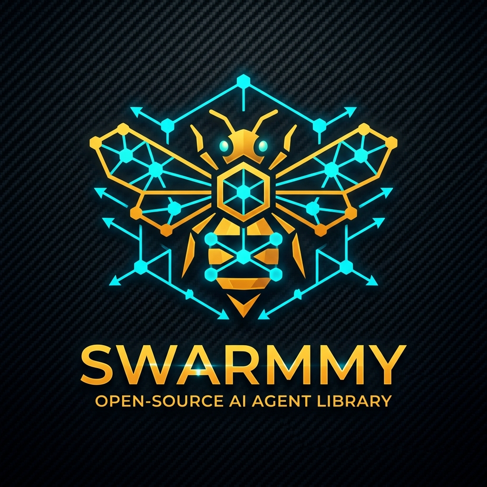
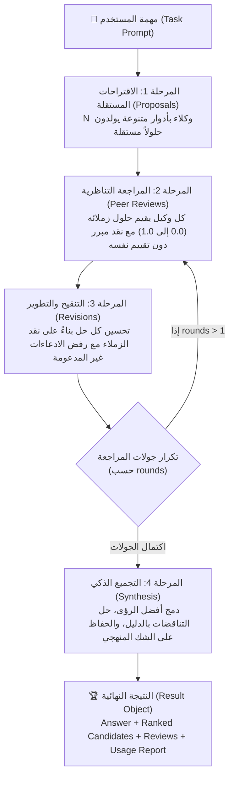

<p align="center">
  
</p>

<h1 align="center">Swarmmy 🐝</h1>

<p align="center">
  <strong>Bounded Peer-Review Swarm Orchestration for Instruction Models</strong><br>
  <em>فريمورك متكامل وعالي الأداء لتنسيق أسراب الوكلاء الذكية عبر دورات المراجعة المتبادلة والتحكم الصارم في الميزانية</em>
</p>

<p align="center">
  <a href="https://pypi.org/project/swarmmy/"></a>
  <a href="https://www.python.org/downloads/"></a>
  <a href="LICENSE"></a>
  <a href="#"></a>
  <a href="#"></a>
  <a href="#"></a>
</p>

<p align="center">
  <a href="#-لماذا-swarmmy-why-swarmmy">لماذا Swarmmy؟</a> •
  <a href="#-التثبيت-installation">التثبيت</a> •
  <a href="#-البدء-السريع-quickstart">البدء السريع</a> •
  <a href="#-الموفرون-المدعومون-supported-providers">الموفرون</a> •
  <a href="#-الدروس-التعليمية-الشاملة-tutorials">الدروس التعليمية</a> •
  <a href="#-العرض-الحي-الملون-live-colored-printer">العرض الملون</a> •
  <a href="#-شروط-الاستخدام-والميزانية-usage-limits">شروط الاستخدام</a> •
  <a href="#-سطر-الأوامر-cli-tool">الـ CLI</a> •
  <a href="README.md">English</a>
</p>

---

## 🌟 لماذا Swarmmy؟ (Why Swarmmy?)

في نماذج اللغة الكبيرة (LLMs)، الاعتماد على استدعاء واحد منفرد (Single Call) غالباً ما يؤدي إلى افتراضات غير مختبرة، وأخطاء منطقية، وهلوسة (Hallucinations). بينما أطر الوكلاء المتعددين التقليدية (Multi-Agent Frameworks) غالباً ما تعاني من **حلقات لا نهائية**، واستهلاك عشوائي للتكلفة، وتضخم هائل في الحزم والتبعيات.

**Swarmmy** يقدم فلسفة هندسية مختلفة تماماً:

| المعيار | Single LLM Call | أطر الوكلاء التقليدية (CrewAI / AutoGen) | **Swarmmy 🐝** |
| :--- | :---: | :---: | :---: |
| **تعدد الرؤى والأدوار** | ❌ رأي واحد | ⚠️ معقد ويتطلب ضبط رسائل طويلة | ✅ **أدوار مستقلة متباينة تلقائياً** |
| **المراجعة النقدية** | ❌ تحيز للتأكيد الذاتي | ⚠️ وكلاء قد يقيمون أنفسهم | ✅ **مراجعة ثنائية منضبطة بدون تقييم ذاتي** |
| **سقف التكلفة والاستدعاءات** | 1 استدعاء | ❌ غير محدد (قد يدخل في حلقة مفرغة) | ✅ **حد رياضي صلب: `N*(2+2R)+1`** |
| **التبعية لحزم خارجية** | يعتمد على الـ SDK | ❌ حزم ثقيلة جداً (>500MB) | ✅ **صفر تبعيات خارجية (Pure Python)** |
| **تقييد المعدل وحماية الـ 429** | يدوي | ⚠️ غير متناسق | ✅ **RPM Throttling + Adaptive 429 Retry** |
| **العرض اللحظي المنسق** | نصوص خام | نصوص غير منظمة | ✅ **لوحة ملونة لكل وكيل ومرحلة فوراً** |

---

## 🔬 المعمارية ودورة العمل (Swarm Architecture)

يعتمد السرب على 4 مراحل محكمة ومحددة رياضياً:



### 📐 المعادلة الرياضية للميزانية (Mathematical Upper Bound):
$$\text{Max Calls} = N \times (2 + 2R) + 1$$
- حيث $N$ = عدد الوكلاء (Agents).
- و $R$ = عدد جولات التنقيح والمراجعة (Rounds).
- **مثال**: 4 وكلاء وجولة واحدة = $4 \times (2 + 2) + 1 = 17$ استدعاء فقط كحد أقصى مستحيل تجاوزه.

---

## 📦 التثبيت (Installation)

يدعم بايثون **3.10 وفوق**:

```bash
# 1. التثبيت الأساسي (يدعم جميع موفري السحاب + Ollama بدون أي مكتبة خارجية)
pip install swarmmy

# 2. إذا كنت تريد تشغيل نماذج Hugging Face محلياً على كرت الشاشة (PyTorch)
pip install 'swarmmy[hf]'
```

---

## 🌐 الموفرون المدعومون (Supported Providers)

تتضمن المكتبة موفرات أصلية لجميع الشركات تعمل مباشرة عبر مكتبة بايثون القياسية:

| الموفر (Provider) | المعرف في `create_provider` | الموديل الافتراضي | المتغير البيئي لمفتاح الـ API |
| :--- | :--- | :--- | :--- |
| **Google Gemini** | `"gemini"` أو `"google"` | `gemini-2.0-flash` | `GEMINI_API_KEY` أو `GOOGLE_API_KEY` |
| **Anthropic Claude** | `"anthropic"` أو `"claude"` | `claude-3-5-sonnet-20241022` | `ANTHROPIC_API_KEY` |
| **OpenAI** | `"openai"` | `gpt-4o-mini` | `OPENAI_API_KEY` |
| **Groq (Llama/Mixtral فائق السرعة)** | `"groq"` | `llama-3.3-70b-versatile` | `GROQ_API_KEY` |
| **DeepSeek (V3 & R1)** | `"deepseek"` | `deepseek-chat` | `DEEPSEEK_API_KEY` |
| **Ollama (محلي بدون إنترنت)** | `"ollama"` | `llama3:latest` | يتصل بـ `http://localhost:11434` |
| **Mistral AI** | `"mistral"` | `mistral-large-latest` | `MISTRAL_API_KEY` |
| **Cohere (Command R+)** | `"cohere"` | `command-r-plus-08-2024` | `COHERE_API_KEY` |
| **OpenRouter (200+ نموذج)** | `"openrouter"` | `meta-llama/llama-3.3-70b-instruct` | `OPENROUTER_API_KEY` |
| **Azure OpenAI** | `"azure"` | حسب الـ Deployment | `AZURE_OPENAI_API_KEY` |
| **Hugging Face (Serverless)** | `"hf-api"` | مخصص | `HF_TOKEN` |
| **Hugging Face (Local GPU)** | `"hf"` | مسار الموديل محلياً | لا يتطلب مفتاح |

---

## 📚 الدروس التعليمية الشاملة (Tutorials)

### الدرس 1: البدء السريع في 30 ثانية (Quickstart)

#### أ. الاستخدام المتزامن (Synchronous):
مناسب جداً للبرامج النصية البسيطة وبيئات Jupyter Notebooks:

```python
from swarmmy import run_sync, create_provider, Config

# إنشاء الموفر (يقرأ مفتاح الـ API تلقائياً من متغيرات البيئة)
backend = create_provider("gemini")

# تشغيل السرب في استدعاء واحد
result = run_sync(
    "اقترح خطة معمارية لمنصة تعليمية تتحمل مليون مستخدم متزامن وراجع نقاط الضعف.",
    backend=backend,
    config=Config(agents=4, rounds=1)
)

print("🏆 الإجابة النهائية المجمعة:")
print(result.answer)
print(f"\nإجمالي الاستدعاءات: {result.calls} | المستغرق: {result.elapsed_seconds:.2f} ثانية")
```

#### ب. الاستخدام غير المتزامن (Asynchronous):
مناسب للخدمات السحابية وتطبيقات الويب عالية الأداء (FastAPI / Starlette):

```python
import asyncio
from swarmmy import Swarm, Config, create_provider

async def main():
    backend = create_provider("anthropic", model="claude-3-5-sonnet-20241022")
    swarm = Swarm(backend=backend, config=Config(agents=4, rounds=1, concurrency=4))
    
    result = await swarm.run("صمم خوارزمية ذكية لموازنة الأحمال وقارنها بالبدائل.")
    
    # فحص حلول المرشحين وتقييمات الزملاء
    for candidate in result.candidates:
        print(f"المرشح {candidate.id} - التقييم الوسطي: {candidate.peer_score}")

    print("\nالإجابة النهائية:\n", result.answer)

if __name__ == "__main__":
    asyncio.run(main())
```

---

### الدرس 2: ربط نماذج محلية عبر Ollama (Offline Swarm)

يمكنك تشغيل السرب بالكامل محلياً بدون إرسال أي بيانات لخوادم سحابية:

```python
from swarmmy import run_sync, create_provider, Config

# تأكد من تشغيل: ollama run llama3 أو ollama run deepseek-r1:8b
backend = create_provider("ollama", model="llama3:latest")

result = run_sync(
    "اشرح الفرق بين Event-Driven Architecture و Monolith مع أمثلة عملية.",
    backend=backend,
    config=Config(agents=3, rounds=1)
)

print(result.answer)
```

---

### الدرس 3: العرض الحي الملون في الوقت الفعلي (Live Rich Colored Console)

تابع تفكير الوكلاء وتقييماتهم اللحظية على الشاشة بألوان متباينة لكل وكيل وفواصل أنيقة:

```python
from swarmmy import run_sync, create_provider, Config

backend = create_provider("groq", model="llama-3.3-70b-versatile")

# تفعيل الطباعة الحية الفورية عبر live=True
result = run_sync(
    "صمم بنية تحتية مقاومة للكوارث موزعة على عدة مناطق جغرافية.",
    backend=backend,
    config=Config(agents=3, rounds=1),
    live=True  # 👈 تفعيل العرض اللحظي الملون
)
```

**شكل المخرجات على الشاشة:**
```text
========================================================================
  >>> STAGE 1: PROPOSALS <<<
      Independent solutions generated across diverse roles
========================================================================

┌─ AGENT 0 (PROPOSE | 0.35s) [OK] ────────────────────────────────────┐
│   Proposal 0: Active-active multi-region deployment with Aurora Global.
└──────────────────────────────────────────────────────────────────────┘

┌─ AGENT 1 (PROPOSE | 0.38s) [OK] ────────────────────────────────────┐
│   Proposal 1: Event-driven replication using Kafka MirrorMaker 2.
└──────────────────────────────────────────────────────────────────────┘

========================================================================
  >>> STAGE 2: PEER REVIEWS <<<
      Cross-evaluating peer solutions (no self-grading)
========================================================================

┌─ AGENT 0 (REVIEW | 0.25s) [OK] ─────────────────────────────────────┐
│   🎯 Review for Agent 1: Score: 0.90 (★★★★★)
│      "Strong consistency guarantees, but consider cross-region network costs."
└──────────────────────────────────────────────────────────────────────┘
```

---

### الدرس 4: شروط الاستخدام، تقييد المعدل والميزانية (Limits & Budgeting)

لحماية حسابك من تجاوز حدود الـ API (مثل 15 RPM في Gemini المجاني) أو استنزاف الميزانية:

```python
from swarmmy import Config, UsageLimits, create_provider, run_sync

# ضبط شروط الاستخدام الصارمة
limits = UsageLimits(
    rpm=15,                   # حد أقصى 15 طلب في الدقيقة (Rate Limiting تلقائي)
    max_total_tokens=40_000,  # سقف أقصى للتوكنز (مدخلات + مخرجات)
    max_cost_usd=0.05,        # سقف مالي أقصى: 5 سنت دولار (يتوقف فوراً عند تجاوزه)
    max_retries=3             # إعادة المحاولة التلقائية عند استلام خطأ 429
)

config = Config(agents=3, rounds=1, limits=limits)
backend = create_provider("gemini")

result = run_sync("سؤال للمناقشة الجماعية", backend=backend, config=config)

# استعراض تقرير الاستهلاك الشامل
report = result.usage
print(f"📊 إجمالي التوكنز: {report.total_tokens}")
print(f"📥 توكنز المدخلات: {report.prompt_tokens} | 📤 توكنز المخرجات: {report.completion_tokens}")
print(f"💰 التكلفة المقدرة: ${report.estimated_cost_usd:.4f} USD")
print(f"⏱️ وقت الانتظار لتفادي الـ Rate Limit: {report.rate_limit_waits_seconds:.2f}s")
```

---

### الدرس 5: تخصيص أدوار الوكلاء والقوالب الجاهزة (Personas & Presets)

يمكنك توجيه الوكلاء في مجالات تخصصية مختلفة:

```python
from swarmmy import Config

# 1. قالب مراجعة وهندسة البرمجيات (Code Review Preset)
config_code = Config(roles="code")

# 2. قالب التفكير الإبداعي والابتكار (Creative Preset)
config_creative = Config(roles="creative")

# 3. أدوار مخصصة تماماً يحددها المستخدم:
security_roles = [
    "ركز بدقة على أمان المعلومات، والتحقق من المدخلات، ومنع ثغرات Injection.",
    "ركز على سهولة القراءة وتطبيق مبادئ Clean Architecture و SOLID.",
    "ركز على استهلاك الذاكرة وسرعة المعالجة وقابلية التوسع (Scalability)."
]
config_custom = Config(roles=security_roles)
```

---

### الدرس 6: ربط دوال ونماذج مخصصة (Custom Callable Provider)

إذا كان لديك كود مخصص، أو عميل SDK خاص (مثل LiteLLM أو Anthropic SDK أو Google GenAI SDK)، يمكنك ربطه في سطرين:

```python
from swarmmy import Swarm, Config

def my_custom_llm(messages, temperature=0.7, max_tokens=1024):
    user_prompt = messages[0]["content"]
    # استدعِ أي خدمة أو نموذج محلي خاص بك
    return "رد النموذج المخصص..."

swarm = Swarm(backend=my_custom_llm, config=Config(agents=3, rounds=1))
result = swarm.run_sync("سؤال للنقاش الجماعي")
print(result.answer)
```

---

## 💻 سطر الأوامر (CLI Tool)

توفر الحزمة أمراً شاملاً في الطرفية `swarmmy`:

```bash
# استخدام Google Gemini مع العرض الحي الملون
swarmmy "صمم خطة بنية تحتية مقاومة للأعطال" --provider gemini --live

# استخدام Anthropic Claude مع تقييد الـ RPM
swarmmy "راجع هذا الكود واقترح تحسينات" --provider anthropic --rpm 20 --live

# استخدام Groq فائق السرعة
swarmmy "اقترح 5 أفكار لمشاريع ناشئة" --provider groq --live

# استخدام Ollama محلياً بدون إنترنت
swarmmy "ما هي أفضل ممارسات الـ Docker؟" --provider ollama --model deepseek-r1:8b

# ضبط ميزانية وسقف للتوكنز والتكلفة
swarmmy "حلل هذا المستند" --provider openai --max-total-tokens 30000 --max-cost 0.10
```

### 📋 خيارات سطر الأوامر الكاملة:
```text
  --provider, --backend   الموفر (gemini, anthropic, openai, groq, deepseek, ollama, mistral, cohere, openrouter, hf, api)
  --model                 اسم الموديل (اختياري، يتم اختيار الموديل الموصى به تلقائياً لكل موفر)
  --api-key               مفتاح الـ API (اختياري، يقرأ تلقائياً من متغيرات البيئة)
  --base-url              عنوان الخادم المخصص (للخوادم المحلية أو المتوافقة)
  --agents                عدد وكلاء السرب (الافتراضي: 4)
  --rounds                عدد جولات المراجعة والتنقيح (الافتراضي: 1)
  --concurrency           الحد الأقصى للطلبات المتزامنة (الافتراضي: 4)
  --max-calls             الحد الأقصى المطلق لعدد الاستدعاءات (الافتراضي: 40)
  --max-tokens            أقصى عدد توكنز لكل رد (الافتراضي: 1024)
  --rpm                   تقييد معدل الطلبات في الدقيقة (Rate Limiting)
  --max-total-tokens      الحد الأقصى الإجمالي للتوكنز المستهلكة
  --max-cost              الحد الأقصى للتكلفة المالية بالدولار USD
  --max-retries           أقصى عدد محاولات إعادة عند خطأ 429 (الافتراضي: 3)
  -l, --live              عرض تفاعلي ملون ومباشر في الوقت الفعلي
  -v, --verbose           عرض سجلات التقدم
  --output                مسار حفظ ملف نتيجة الـ JSON (الافتراضي: swarmmy-result.json)
```

---

## 📑 مرجع الواجهات البرمجية (API Reference)

### 1. `Config`
```python
Config(
    agents: int = 4,              # عدد الوكلاء (>= 2)
    rounds: int = 1,              # جولات المراجعة (>= 0)
    concurrency: int = 4,         # التوازي الأقصى للطلبات
    max_calls: int = 40,          # سقف ميزانية الاستدعاءات الكلي
    max_tokens: int = 1024,       # أقصى توكنز لكل توليد
    peer_chars: int = 3000,       # حد محارف حل الزميل في لوحة المراجعة
    roles: str | Sequence[str] = None, # اسم القالب ("code", "creative") أو قائمة أدوار
    limits: UsageLimits = None,   # كائن حدود الاستخدام والميزانية
    rpm: int = None,              # اختصار لتحديد الـ RPM
    max_total_tokens: int = None, # سقف التوكنز التراكمي
    max_cost_usd: float = None,   # سقف التكلفة بالدولار
    max_retries: int = 3          # محاولات الإعادة عند 429
)
```

### 2. `Result`
```python
result.answer               # النص النهائي المجمع للسرب (str)
result.candidates           # قائمة الحلول المرشحة (list[Candidate])
result.reviews              # قائمة مراجعات وتقييمات الزملاء (list[Review])
result.trace                # سجل خطوات التتبع التفصيلي (list[TraceEvent])
result.calls                # عدد استدعاءات النموذج الفعلية (int)
result.elapsed_seconds      # وقت التنفيذ الإجمالي بالثواني (float)
result.warnings             # قائمة التحذيرات أو الاستثناءات المعالجة (list[str])
result.usage                # كائن تقرير الاستهلاك (UsageReport)
result.to_dict()            # تحويل النتيجة لقاموس بايثون متسلسل
result.to_json(indent=2)    # تحويل النتيجة لنص JSON منسق
```

---

## 🧪 الاختبارات والجودة (Tests & Quality)

تم تغطية كافة ميزات المكتبة بـ **36 اختبار وحدة وتكامل** بنسبة نجاح 100%:

```bash
python -m unittest discover -s tests -v
```

---

## 🤝 المساهمة (Contributing)

نرحب بكافة المساهمات والاقتراحات! يمكنك:
1. فتح Issue لمناقشة ميزة جديدة أو الإبلاغ عن مشكلة.
2. إرسال Pull Request بعد التأكد من اجتياز كافة الاختبارات `python -m unittest discover -s tests`.

---

## 📄 الترخيص (License)

مرخص بالكامل تحت رخصة **[MIT License](LICENSE)** مفتوحة المصدر.
جميع الحقوق محفوظة © 2026 فريق Swarmmy.
